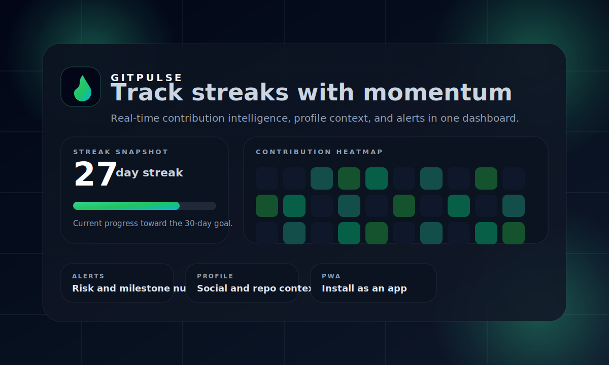
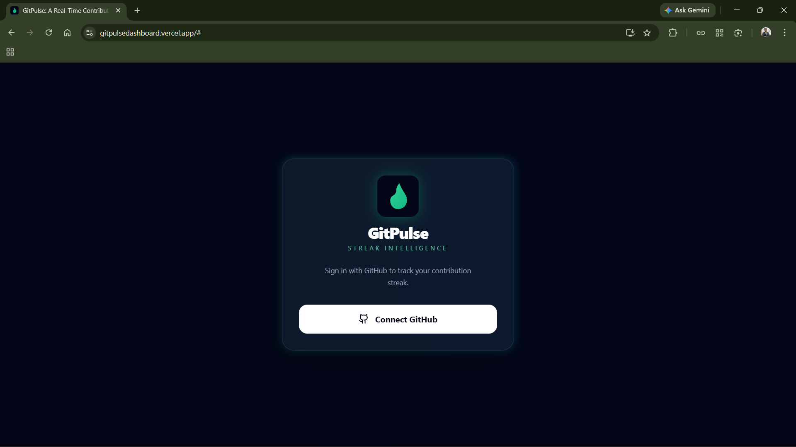
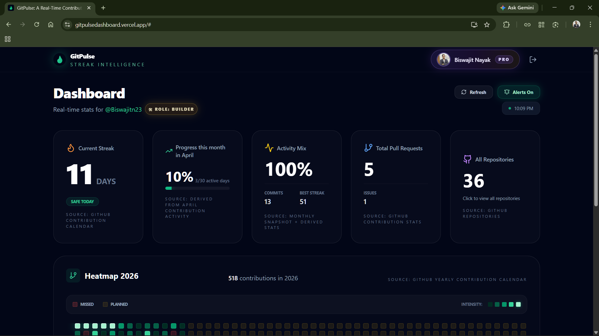
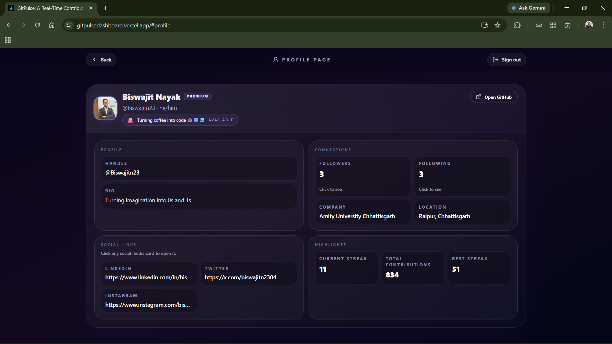

# GitPulse

GitPulse is a dark, neon-styled dashboard for tracking GitHub contribution streaks, activity patterns, and momentum over time. It combines GitHub data, Firebase auth, PWA install support, and streak intelligence into a single focused experience.

[Live Demo](https://gitpulsedashboard.vercel.app/)



Track your streak, understand your activity shape, and keep momentum visible at a glance.

[](https://react.dev/)
[](https://vite.dev/)
[](https://tailwindcss.com/)
[](https://firebase.google.com/)
[](https://docs.github.com/)

## Table Of Contents

- [Overview](#overview)
- [Highlights](#highlights)
- [Configuration](#configuration)
- [Local Setup](#local-setup)
- [How It Works](#how-it-works)
- [Deployment](#deployment)
- [Troubleshooting](#troubleshooting)

## Overview

GitPulse is built to do more than display a streak count. It turns contribution history into a readable dashboard with daily drill-downs, role-based guidance, profile details, and alerts that help you keep momentum.

The design goal is simple: make GitHub activity feel immediate, elegant, and easy to act on.

## Highlights

- Live current streak and longest streak tracking.
- Contribution heatmap with hover on desktop and tap on mobile.
- Role-based streak guidance that classifies contribution style and suggests next goals.
- Profile view with social links, repository breakdowns, and contribution metrics.
- Browser notifications for streak risk, streak loss, and milestone events.
- PWA install prompt for a more app-like desktop and mobile experience.
- Login-first flow with Firebase GitHub authentication.

## Screenshots

<table>
   <tr>
      <td align="center">
         
         <br />
         <strong>Login</strong>
      </td>
      <td align="center">
         
         <br />
         <strong>Dashboard</strong>
      </td>
      <td align="center">
         
         <br />
         <strong>Profile</strong>
      </td>
   </tr>
</table>

## Configuration

Create a `.env` file in the project root and add the values you use for auth and GitHub access.

```bash
VITE_FIREBASE_API_KEY=...
VITE_FIREBASE_AUTH_DOMAIN=...
VITE_FIREBASE_PROJECT_ID=...
VITE_FIREBASE_APP_ID=...
VITE_GITHUB_TOKEN=...
```

- `VITE_FIREBASE_*` powers Firebase Sign-In with GitHub.
- `VITE_GITHUB_TOKEN` lets the streak API resolve GitHub data locally.

## Local Setup

1. Install dependencies.

   ```bash
   npm install
   ```

2. Make sure Firebase Authentication is enabled and the GitHub provider is turned on.

3. Start the app.

   ```bash
   npm run dev
   ```

4. Open the local URL and sign in with GitHub.

## How It Works

- The dashboard authenticates the user with Firebase and stores session data locally for faster return visits.
- The GitHub streak data is fetched from the local `/api/github-streak` endpoint during development.
- Contribution heatmap cells can be opened to inspect day-level activity.
- Notification logic watches for risk, loss, and milestone events once alerts are enabled.

## Deployment

- Build command: `npm run build`
- Output directory: `dist`
- On Vercel, keep `api/github-streak.js` deployed so production requests to `/api/github-streak` resolve correctly.

## Troubleshooting

- If no streak data appears, confirm `VITE_GITHUB_TOKEN` is present and valid.
- If GitHub login fails, verify the GitHub provider is enabled in Firebase.
- If notifications do not show up, allow browser notifications in site settings.
- If deployment returns 404s for `/api/github-streak`, confirm the Vercel API route is active.

## Notes

- The dashboard is intentionally login-first.
- Heatmap drill-downs work on both desktop hover and mobile tap.
- The app still works if browser notifications are blocked; only alerts are disabled.